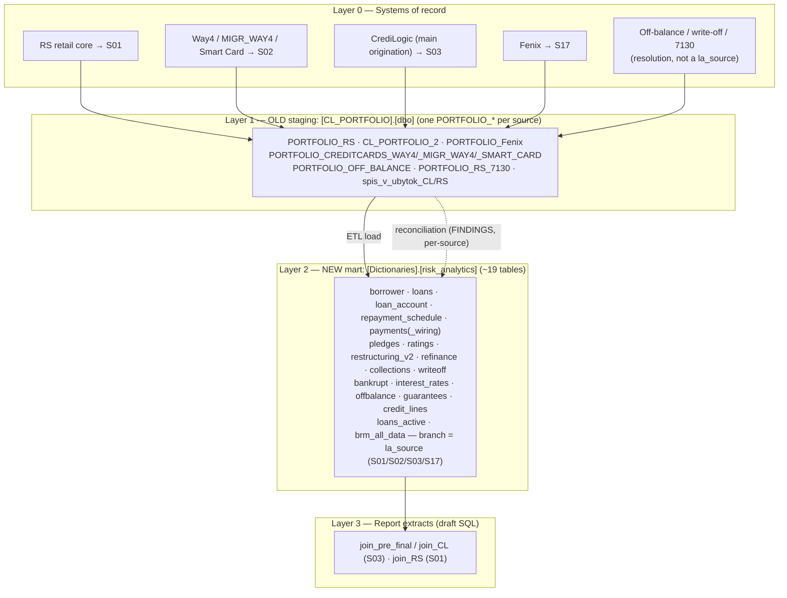
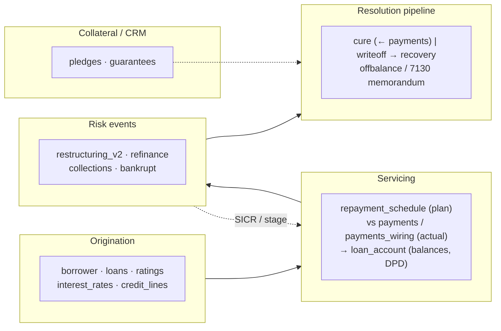

# Knowledge base — credit-risk loan data architecture (AO "Eurasian Bank")

Holistic reference for the loan/provisioning data pipeline: the **source
portfolio branches**, the **`CL_PORTFOLIO` staging layer**, the full
**`Dictionaries.risk_analytics` mart**, the **account-computation conventions**,
and a **correctness + reconciliation** view — grounded in the NBK Standard Chart
of Accounts and in the БРМ reconciliation project's data-proven findings.

> **Two tiers of evidence.**
> 1. **Ground truth (data-proven).** The БРМ reconciliation project's
>    [`risk_dwh_reconciliation/FINDINGS.md`](risk_dwh_reconciliation/FINDINGS.md)
>    (CONFIRMED / OPEN / DISPROVEN on live queries, snapshot 01.07.2026) and its
>    charter [`risk_dwh_reconciliation/CLAUDE.md`](risk_dwh_reconciliation/CLAUDE.md).
>    **These override any inference below.**
> 2. **Draft-derived.** The SQL files (`join_CL.sql`, `join_pre_final.sql`,
>    `join_RS.sql`) are working drafts / *idea warehouse* — they show how
>    colleagues join tables and compute accounts. Column detail for the 5 tables
>    they touch is in
>    [`risk_analytics_data_model.md`](risk_analytics_data_model.md).

## Краткое содержание (RU)

- **Два слоя.** OLD `CL_PORTFOLIO.dbo.*` (по таблице `PORTFOLIO_*` на источник) →
  NEW `Dictionaries.risk_analytics.*` (март), ветку различает `la_source`.
- **`la_source` = 4 кода (CONFIRMED):** `S01`=RS, `S02`=Cards (UNION Way4 /
  MIGR_WAY4 / SMART_CARD), `S03`=CrediLogic, `S17`=Fenix. OFF_BALANCE / RS_7130 /
  spis_v_ubytok — это **resolution/меморандум** таблицы, а не значения `la_source`.
- **Глобальный ключ — `l_gid` / `la_gid`, НЕ номер договора** (номер не глобален:
  9659 коллизий между источниками). Ключ old↔new — **свой на каждый источник**
  (§3).
- **Витрина = ~19 таблиц** с уровнями критичности P0/P1/P2 (§4) и картой МСФО 9
  (§5).
- **Сквозной итог сверки:** **баланс сходится везде; провизии (1428/18771) и DPD
  расходятся везде** — два системных вопроса к автору марта, не разовый дефект
  (§9).
- **Проверить/решено:** 18770/1877 **корректно НЕ входят** в `provisions_total`
  (identity ломается — RESOLVED). Осталось: валентность 1428 (+28 млрд → модель),
  семантика DPD/NULL, S02 (не тронут, самый рисковый).

## 1. Scope and regulatory basis

The pipeline produces the per-contract loan book, its IFRS 9 provisions and the
regulatory extracts. GL account columns (`la_account_XXXX`) follow:

- **[V1100006793](https://adilet.zan.kz/rus/docs/V1100006793)** — *Standard
  Chart of Accounts for second-tier banks…* (NBK Board Resolution №3 of
  31.01.2011, MoJ reg. №6793). Defines the account classes/numbers in §6.
- **[NBK accounting-rules amendments](https://nationalbank.kz/file/download/62676)**
  — bank bookkeeping / financial-reporting rules.

Provisioning follows **IFRS 9** (ECL, staging, SICR). The reconciliation project
is **read-only** (SELECT / `#temp` only), parameterises source/date/tolerance,
and outputs **aggregates only** — no PII (ИИН/ФИО/contract numbers/IBAN). Only
schema, logic and aggregate figures appear here.

## 2. Architecture — the four layers



- **Layer 0/1 — OLD `CL_PORTFOLIO`.** One `PORTFOLIO_*` table per source system;
  the `Cl_portfolio` side of every reconciliation.
- **Layer 2 — NEW `Dictionaries.risk_analytics` mart.** The consolidated model
  (~19 tables, §4); `la_source` marks the source branch.
- **Layer 3 — report extracts.** Draft `join_*.sql` read the mart per contract.

The whole project's purpose: **reverse-engineer and verify the NEW mart against
the OLD branch** (mart author unavailable, no spec → everything proven on data)
so all business processes can migrate to the new DWH.

## 3. The branches and the `la_source` map (CONFIRMED)

`la_source` has **four** values — one dictionary, confirmed on data. The
contract number is **not** a global key (9,659 cross-source collisions); the
global key is `l_gid` (§4).

| `la_source` | System | OLD staging table(s) | OLD↔NEW key (proven by coverage) |
|---|---|---|---|
| **`S01`** | RS (retail core) | `PORTFOLIO_RS` | `contract_id → l_loan_id` (loan_id **works** here) |
| **`S02`** | Cards {Way4, SMARTCARD, Installment, kpk, Payda} | `PORTFOLIO_CREDITCARDS_WAY4` + `_MIGR_WAY4` + `_SMART_CARD` (UNION) | `contract_number (varchar20) → l_loan_number` |
| **`S03`** | CrediLogic (main origination) | `CL_PORTFOLIO_2` | `contract_number → l_loan_number` (raw string; `l_loan_id` = **0** matches — different id space) |
| **`S17`** | Fenix | `PORTFOLIO_Fenix` | `contractnumber → la_dog_num` + `source=S17` + date (`contract_id` non-unique: up to 33 contracts/id) |

> **Why keys differ per source.** Different source systems populate `la_loan_id`
> differently — S01's loan_id key matches, S03's returns 0. This is a *property of
> the data*, not inconsistency: **always test the key by coverage per source, not
> by column name** (`la_loan_id` matched 0 for S03 despite the name).

**Resolution / memorandum tables (not `la_source` branches).** `OFF_BALANCE`,
`RS_7130` and `spis_v_ubytok_CL/RS` are the OLD-side registers for off-balance
contingents (Class VI) and debts written off to loss (Class VII memorandum, acct
`7130`, loan status `I`). They feed the mart's **`offbalance` / `writeoff` /
`collections`** tables (the step-9 *resolution pipeline*), and must **not** be
summed into live balance-sheet exposure.

## 4. The mart tables — full inventory

~19 tables. Criticality tiers: **P0** foundation · **P1** ECL drivers · **P2**
exposure completeness · **View** derived. Types: **Dim** master · **Snap**
periodic snapshot · **Event** transactional log · **View**.

| Table | Tier | Type | Answers (semantic) | Grain / key | Primary risk role |
|---|---|---|---|---|---|
| `borrower` | **P0** | Dim | кто клиент | 1 / borrower · `b_borrower_id` | Counterparty, borrower-level PD |
| `loans` | **P0** | Dim | какой кредит | **1 / `l_gid`** (`l_report_date` = state marker, not snapshot key) | Product, term, currency, purpose |
| `loan_account` | **P0** | Snap | сколько должен по счетам | **`la_gid` × `la_reporting_date` × `la_source`** (control `la_dog_num`) | Exposure, overdue, provisions base; **defines population** |
| `repayment_schedule` | **P1** | Snap/plan | сколько должен платить по графику | contract × installment | DPD, cash flow, EIR |
| `payments` | **P1** | Event | сколько реально заплатил | 1 / payment | Cure, DPD, behavioural PD |
| `payments_wiring` | **P1** | Event | как платёж разложился | 1 / payment component | Allocation → `loan_account` buckets |
| `pledges` | **P1** | Dim | какой залог | collateral / contract | LGD, recovery, coverage |
| `ratings` | **P1** | Dim (versioned) | какой рейтинг/риск | borrower/contract × date | PD, internal grade |
| `restructuring_v2` | **P1** | Event | меняли ли условия | restructuring event | SICR → Stage 2/3, forbearance |
| `writeoff` | **P1** | Event | списали ли долг | write-off / contract | NPL bridge, recovery (→ 7130/spis_v_ubytok) |
| `collections` | **P1** | Event | передали ли во взыскание | contract/borrower × case | Problem assets → Stage 3 |
| `bankrupt` | **P1** | Event/flag | есть ли банкротство | 1 / borrower | Hard default → Stage 3 |
| `interest_rates` | **P1** | Dim | какие ставки | contract · `dlcr_dog_num` | EIR, discounting |
| `offbalance` | **P2** | Snap | внебалансовые обязательства | contract × date | EAD/CCF, Class VI |
| `guarantees` | **P2** | Dim/Event | есть ли гарантии | guarantee / contract | CRM, LGD |
| `credit_lines` | **P2** | Dim/Snap | лимиты / неиспользованная часть | line / contract | Undrawn × CCF → EAD |
| `refinance` | **P2** | Event | новый кредит вместо старого | old → new link | Condition change, roll-over risk |
| `loans_active` | **View** | View | только действующие | filtered `loans` | Live-book filter |
| `brm_all_data` | **P0/P1** | View | общая витрина БРМ | wide, contract × date | Final consumption mart (P0 if reports read it) |

**Join model (CONFIRMED).** The **global key is `l_gid`** (loans) ↔ **`la_gid`**
(loan_account), matched with `la_source = l_source`; `la_dog_num = l_loan_number`
is a control, not the cross-source key. Because the contract number collides
across sources, joins on it must be **scoped per `la_source`** using the
per-source keys in §3. **Population** is defined by membership in `loan_account`
at a `la_reporting_date` (`loans` carries no snapshot). Grain is clean per source;
prefer `gid` over `dog_num` (S17 has one `dog_num` collision per snapshot).

**S02 caveat.** For cards, the **product dimension is absent** in the mart —
`l_product_type / l_subproduct_type / l_loan_type / l_segment /
l_credit_purpose / l_loan_purpose` are **NULL on all rows**; only `l_tag` (a 0/1
flag) is filled. Cards can be reconciled by perimeter/balance/provisions, **not**
by product.

**Detailed columns.** Only `loans`, `borrower`, `loan_account`, `pledges`,
`interest_rates` are catalogued at column level (they appear in the drafts) — see
[`risk_analytics_data_model.md`](risk_analytics_data_model.md). Other tables'
columns/keys are open (§11).

## 5. Credit-risk lifecycle & IFRS 9 mapping



| IFRS 9 input | Driven by | Notes |
|---|---|---|
| **DPD** | `loan_account` (`days_past_due`), `repayment_schedule` vs `payments` | 30+ → Stage 2 presumption; 90+ → default. **DPD diverges everywhere (§9)** |
| **SICR / forbearance** | `restructuring_v2`, `refinance` | Modification → Stage 2/3 |
| **Default (Stage 3)** | `bankrupt`, `collections`, `writeoff`, 90+ DPD | Hard + soft markers |
| **Cure** | `payments`, `payments_wiring` | Return toward Stage 1 |
| **PD** | `ratings`, `bankrupt` | Rating grade + default flags |
| **LGD** | `pledges`, `guarantees`, `writeoff` | Coverage + recovery experience |
| **EAD** | `loan_account`, `credit_lines` (undrawn × CCF), `offbalance` (CCF) | On- + off-balance |
| **EIR** | `interest_rates`, `repayment_schedule` | Discounting of cash flows |
| **Booked ECL** | `loan_account` (`1428` + `1845` + `18771`) | Posted provision (§7) |

> **Bucket vs DPD (S17 finding).** `delinquency_bucket` is formed **independently
> of the DPD fields** (S17: basket 99.98% correct while DPD is mostly NULL). Which
> field is the normative source for 90+/staging is an open question (§11).

## 6. GL accounts — regulatory map

Classes: **1** assets, **2** liabilities, **6** contingents, **7** memorandum.

**Confirmed against the Standard Chart of Accounts:**

| Account | Official grouping | Role |
|---|---|---|
| `1401`,`1403`,`1411`,`1417` (grp `1400`) | Требования к клиентам (client loans) | Current **principal** = `outstanding` |
| `1424` | Просроченная задолженность клиентов | **Overdue principal** |
| `1428` | Резервы (провизии) по займам/лизингу | **IFRS provision** (main ECL) |
| `1740` / `1741` | Начисленные доходы (accrued / overdue) | Interest / overdue interest |
| Class 7 (`7130`) | Долги, списанные в убыток (memorandum) | Write-off tail (`writeoff`, `spis_v_ubytok`) |

**Functional (verify caption vs COA):** `1430/1431/1434/1435` discounts (ХД/КХД);
`1773/1774/1775/1784` deferred income/discount (1700-series); `1818` commissions;
`1838` overdue commissions; `1845` provision component; `1860` fees; `1879`
penalties; `2794` Class-2 deferred; `1877` (+ analytic `18770`/`18771`) IFRS
provision. **Identity (S01, CONFIRMED):** `1877 = 18770 + 18771` (`18770` = 0 on
the slice).

## 7. Account computation — formulas & identities

Canonical formulas the drafts share, plus identities **proven on data**
(FINDINGS §3):

```text
outstanding            = 1401 + 1403 + 1411 + 1417
od                     = outstanding + 1424
balance (gross)        = od + 1740 + 1741 + 1879 + 1818 + 1838      -- CONFIRMED; incl. interest
OD_percent             = od + 1740 + 1741
balance_with_discount  = balance - (1434+1773+1774+1784) - (-1435+1775)   -- EAD
provisions_total       = 1428 + 1845 + 18771       -- CONFIRMED on all 237,274 S03 rows
                                                    -- (+18770/1877 BREAKS the identity → excluded)
S17 old ifrs_balance   = outstanding + outstanding_overdue + interest + overdue_interest + penalties  -- 100%
S17 new total_balance  = 1401+1403+1411+1417+1424+1740+1741+1879   -- CONFIRMED
S01 new 18771          = PORTFOLIO_RS.deb_1877_prov + [_1877]
dpd                    = days_past_due - 1
```

`provisions_calculated = (balance - (1434 - (-1435) - 1773)) * reserve% / 100` —
a legacy recompute (see finding #1). Delinquency buckets on `days_past_due`:
no-overdue / 1–29 / 30–59 / 60–89 / 90+.

## 8. Correctness review — «всё ли там правильно»

**C** = confirmed defect, **V** = verify / design decision, **R** = resolved.

| # | Sev | Where | Finding | Fix / status |
|---|---|---|---|---|
| 1 | **C** | `provisions_calculated` vs EAD | Provisions base `balance − 1434 − 1435 + 1773` ≠ EAD base `balance − 1434 − 1773 − 1774 − 1784 + 1435 − 1775` (opposite signs on `1773`/`1435`; provisions omit `1774/1775/1784`). A legacy recompute predating the newer discounts. | Agree ONE discount base; almost certainly reuse EAD. |
| 2 | **C** | `join_RS.sql` `b.b_oked` | Alias `b` undefined (borrower = `br`) → won't compile. | `br.b_oked`. |
| 3 | **C** | `1435` sign | CL/pre-final negate `1435`; RS uses it raw. | Normalise sign at the mart layer. |
| 4 | **C** | DPD `-1` offset | CL applies `-1` to `dpd` only; RS to the day columns too. | Fix once in the mart. |
| 5 | **C** | `join_RS.sql` `CASE` | `120000000000004209` duplicated (dead branch). | Delete; use a lookup table. |
| 6 | **V** | Join fan-out | 1-to-many tables (`pledges`, `interest_rates`, `payments`, `restructuring_v2`, `guarantees`) multiply money columns if joined un-aggregated. | Enforce ≤1 row/loan before joining. |
| 7 | **V** | Cross-source de-dup | Join/union on the contract number double-counts (9,659 collisions); memorandum tables must not sum with live balance. | Key on `gid` + `source`; separate resolution tables. |
| 8 | **R** | `provisions_total` composition | **Resolved:** `1428 + 1845 + 18771`; adding `18770`/`1877` **breaks** the identity across all 237,274 S03 rows, so they are correctly **excluded**. | No change — confirmed correct. |
| 9 | **V** | `'status'` semantics | `join_pre_final` labels `l_loan_status`, `join_CL` labels `la_status`, both as `status`. | Name `loan_status` vs `account_status`. |
| 10 | **C (data)** | Key ≠ column name | `la_loan_id` matched **0** for S03; contract number is not global (9,659 collisions). | Always test key by **coverage per source**; use `gid`. |

Core assembly (`outstanding → od → balance`) and `provisions_total` are
data-confirmed. Issues concentrate in the **provision base (#1)** and
**cross-source keying / de-dup (#7, #10)**.

## 9. Reconciliation — data-proven (FINDINGS, 01.07.2026)

**Sweeping conclusion:** **balance reconciles across every source; provisions
(`1428`/`18771`) and DPD diverge across every source.** These are two *systemic*
questions for the mart author, not one-off defects.

| Source | Perimeter (old / new / matched) | Balance | Provisions | DPD |
|---|---|---|---|---|
| **S01** RS | 4,385 / 4,838 / 4,380 (by `loan_id`) | ✓ −0.02 ₸ | ✓ 100% (25.51 bn) | ✗ NULL 3,618/4,380; Jun→Jul +60%; +284 new-90+ vs old-0 |
| **S03** CL | 237,274 / 237,386 / 234,367 (234,362 ≤0.01 ₸) | ✓ Δ 140,854 ₸ | ✗ **new higher +30.6 bn** | ✗ NULL 205,264; DPD=−1 |
| **S17** Fenix | 79,621 / 90,596 / 79,617 (by `contractnumber`) | ✓ Δ −5.6 M (4 contracts) | ✗ new higher +29.8 M (`18771`) | ✗ interest-DPD all NULL; 90+ lost on 932 (273 M) |
| **S02** Cards | **not yet reconciled — next, riskiest** | — | — | — |

- **S03 provisions +30.6 bn is CONFIRMED real** (composition holds). It splits:
  **`1428` ≈ 28.2 bn → owner = MODEL** (revaluation) and **`18771` ≈ 2.3 bn →
  owner = ETL / population**. Lumping both into "new is higher" is under-resolved.
- **ONLY_OLD / ONLY_NEW.** S03 ONLY_OLD 2,907 = status **V (terminated)**;
  ONLY_NEW ~3,019 of which ~1,000 status **O with zero balance** = a mart
  **over-retention defect** (stale Opens stuck since Jan-2026, tag 11).
- **S02 is untouched and highest-risk**: UNION of three card tables across the
  **Feb-2026 migration break** (`loan_account` S02 ~185k/mo → 31k), product fields
  NULL, defect cluster B1A (`ID`/`LOAN_ID_KR`). Prove key + date + population
  before provisions.

### DISPROVEN — do not repeat

- ❌ **"S03: 17.2 bn lost exposure."** Reality: 2,907 contracts = status **V
  (terminated)**, confirmed both branches. Gross 17.2 / od 14.1 / prov 8.5 →
  **net ~5.6 bn**. Direction is **reversed**: OLD *over-retains* terminated
  contracts; the mart correctly *excludes* them by lifecycle rule. **This is the
  same phenomenon as the +17.55 bn overdue-principal break in the 2026-04-01
  aggregate below** — an OLD over-retention, not a mart loss.
- ❌ **"balances changed ⇒ alive."** Movement in 824/2,902 (28%) is residual
  accounting, not a live loan.
- ❌ **"Installment/kpk/Payda are structurally ONLY_NEW."** Reality: S02 product
  fields NULL on all 27,825 rows → products can't be matched because the S02
  product dimension is **absent** in the mart.
- ✅ **"S03 2,907 not in writeoff/collections/offbalance"** — held after re-keying
  by `gid` (a string key gave a false 0; `gid` also gives 0 = real absence).

### 2026-04-01 aggregate (earlier `Сравнение` workbook)

The `CL_PORTFOLIO` staging ↔ mart aggregate at 2026-04-01 (₸ bn):

| Metric | Cl_portfolio | Dictionaries | Δ |
|---|---:|---:|---:|
| Contracts | 263,450 | 261,464 | +1,986 |
| Outstanding | 904.87 | 902.97 | +1.90 |
| Overdue principal (`1424`) | 23.29 | 5.74 | **+17.55** |
| `balance` | 962.02 | 937.33 | +24.69 |
| Provisions `1428` | 108.62 | 113.96 | −5.34 |
| EAD | 933.28 | 910.90 | +22.39 |
| `provisions_calculated` | 127.48 | 112.62 | +14.85 |
| `provisions_total` | 109.06 | 117.01 | −7.95 |

The **+17.55 bn overdue break is explained by the DISPROVEN item above** (OLD
retains terminated-contract overdue the mart drops). Provisions being higher in
the mart (`1428` −5.34; `provisions_total` −7.95) is **directionally consistent**
with the S03 +30.6 bn at 01.07.2026. The workbook is an ETL DQ control before the
numbers feed provisioning/regulatory reporting.

## 10. Reconciliation method & guardrails

From [`risk_dwh_reconciliation/CLAUDE.md`](risk_dwh_reconciliation/CLAUDE.md) —
the discipline behind the findings above:

- **Spiral order.** schema/key types → `source` domain → grain (`raw_rows` vs
  `distinct_key`) → key **by coverage** → align dates to month-start → FULL OUTER
  perimeter → balances on MATCHED → economic substance → provisions/DPD/90+ →
  resolution pipeline. *Don't deepen until the prior turn closes with a **cause**,
  not a number.*
- **Antipatterns.** Column name ≠ semantics · presence-in-table ≠ live loan ·
  `NULL` ≠ 0 (and `NULL days_past_due` ≠ no overdue) · `INNER JOIN` is blind to
  ONLY_OLD/ONLY_NEW · "new higher" ≠ "new wrong" (need an IFRS 9/accounting
  benchmark) · triple-zero across three tables = a **broken key**, re-key by
  `gid` before concluding absence.
- **SQL engine rules.** Read-only (SELECT / `#temp`); `MAXDOP 1` on heavy
  queries; no PII in output; source/date/tolerance are parameters; **do not bake
  normalisation into JOINs** (raw key = normalised, 259,905 = 259,905;
  `UPPER(LTRIM(RTRIM()))` on both sides makes the JOIN non-sargable → hangs);
  aggregate first, then detail.

## 11. Open questions (for the mart author / human)

Resolved by FINDINGS: `la_source` map (§3); global key `l_gid` (§4);
`provisions_total` composition (#8). **Remaining:**

1. **Valence of `1428` (+~28 bn):** does the new over-value or the old
   under-reserve? Needs an accounting / approved IFRS 9 benchmark.
2. **Semantics of new-`1428` vs old-`1428`** — the formula identity holds; the
   *meaning* identity is unproven.
3. **S2T rules for `1428` / `18771` / DPD source** across all sources.
4. **DPD mass-NULL** — fill semantics; is `−1`/`1→0` allowed; the Jun→Jul jump.
5. **Normative field for 90+/buckets** — DPD or `delinquency_bucket`? (S17:
   bucket is independent of DPD.)
6. **S02 product markup** — dropped in migration, or fetched from a dictionary by
   `gid`?
7. **`brm_all_data` scope** — is it the final consumption витрина (→ P0)? What's
   pre-joined, at what grain?
8. **Owner of the current provisioning report** — source of the 8.5 bn on
   terminated contracts (double count?).

## 12. Glossary (RU/EN)

| RU | EN / meaning |
|---|---|
| Требования к клиентам | Client loans (class 1400) |
| Провизии / резервы | Provisions / ECL (`1428`+`1845`+`18771`) |
| Основной долг (ОД) | Principal (`outstanding`; `od` incl. overdue `1424`) |
| Просрочка / DPD | Overdue / days past due |
| Списание в убыток | Write-off to loss (class 7 memo, `7130`) |
| Реструктуризация / рефинанс | Restructuring / refinancing → SICR |
| Взыскание | Collections → Stage 3 |
| Кюр (cure) | Return from Stage 2/3 to Stage 1 |
| Валентность | Valence — which branch is right (needs a benchmark) |
| Периметр / бакет | Perimeter / bucket (MATCHED / ONLY_OLD / ONLY_NEW) |
| Ветка / источник (`la_source`) | Branch / source (S01/S02/S03/S17) |
| `l_gid` / `la_gid` | Global loan key (not the contract number) |
| SICR / Stage 1-2-3 | Sig. increase in credit risk / staging |
| PD / LGD / EAD / CCF / EIR | ECL parameters |

## Sources

- [FINDINGS.md — ground truth (data-proven, 01.07.2026)](risk_dwh_reconciliation/FINDINGS.md)
- [CLAUDE.md — reconciliation project charter & rules](risk_dwh_reconciliation/CLAUDE.md)
- [V1100006793 — Standard Chart of Accounts, second-tier banks (NBK, 31.01.2011)](https://adilet.zan.kz/rus/docs/V1100006793)
- [NBK accounting-rules amendments (nationalbank.kz file 62676)](https://nationalbank.kz/file/download/62676)
- Draft SQL `join_CL.sql` / `join_pre_final.sql` / `join_RS.sql`; workbook `Сравнение_2026-04-01.xlsx`
- Companion: [`risk_analytics_data_model.md`](risk_analytics_data_model.md)
