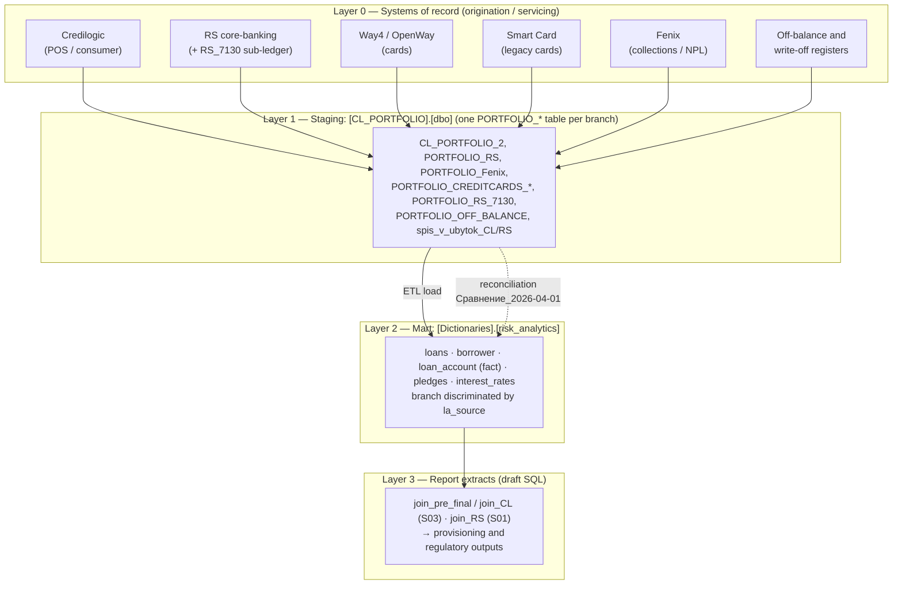

# Knowledge base — credit-risk loan data architecture (AO "Eurasian Bank")

Holistic reference for the loan/provisioning data pipeline: the **source
portfolio branches**, the **`CL_PORTFOLIO` staging layer**, the
**`Dictionaries.risk_analytics` mart**, the **account-computation conventions**
distilled from the team's draft SQL, and a **correctness review** of those
drafts — grounded in the National Bank of Kazakhstan (NBK) Standard Chart of
Accounts.

> **Status of inputs.** The SQL files (`join_CL.sql`, `join_pre_final.sql`,
> `join_RS.sql`) are **working drafts**, not production DDL. They are treated
> here as an *idea warehouse* — they encode how colleagues join the tables,
> which columns they use, and how they compute the GL accounts. This KB extracts
> the durable knowledge and flags what looks wrong. Companion detail on the mart
> schema lives in
> [`risk_analytics_data_model.md`](risk_analytics_data_model.md).

## Краткое содержание (RU)

- **Два слоя данных.** Источник — база `CL_PORTFOLIO` (по одной таблице
  `PORTFOLIO_*` на каждую систему-источник / «ветку»). Витрина — схема
  `Dictionaries.risk_analytics` (модель `loans / borrower / loan_account /
  pledges / interest_rates`), где «ветку» различает поле `la_source`.
- **Ветки (источники):** Credilogic (CL), RS ( core-banking), Fenix, кредитные
  карты (Way4, Smart Card, миграция Way4), RS_7130, внебалансовые (OFF_BALANCE),
  списанные в убыток (spis_v_ubytok CL/RS).
- **Счета** — из Типового плана счетов НБРК (V1100006793): 1400 — требования к
  клиентам (ОД), 1424 — просроченный ОД, 1740/1741 — вознаграждение, 1428 —
  провизии, 7-й класс (7130) — меморандум (списание в убыток).
- **Что проверить (главное):** база расчёта `provisions_calculated` не совпадает
  с базой `EAD` по знакам счетов 1773/1435 и по набору дисконтов
  (1774/1775/1784) — см. §7. Плюс: неопределённый алиас `b`, дубликат в CASE,
  разное применение `-1` к дням просрочки, риск размножения строк по
  залогам/ставкам, риск двойного счёта при объединении веток.

## 1. Scope and regulatory basis

This pipeline produces the per-contract loan book, its IFRS provisions and the
regulatory extracts for the credit-risk workstream. The GL account columns
(`la_account_XXXX`) are the bank's ledger accounts as defined by:

- **[V1100006793](https://adilet.zan.kz/rus/docs/V1100006793)** — *Standard
  Chart of Accounts for second-tier banks, mortgage organisations, JSC
  "Development Bank of Kazakhstan" and branches of non-resident banks* (NBK Board
  Resolution №3 of 31.01.2011, MoJ reg. №6793). Defines the account classes and
  numbers used throughout §5.
- **[NBK accounting-rules amendments](https://nationalbank.kz/file/download/62676)**
  — resolutions amending bank bookkeeping / financial-reporting rules (assets,
  liabilities, equity, income, expenses; consolidated reporting).

Only schema, query logic and **aggregate** figures appear here. Borrower-level
data and PII fields (`b_borrower_name`, `b_iin_bin`, `b_rnn`) are marked and not
reproduced.

## 2. Architecture — the four layers



- **Layer 0 — systems of record.** The operational platforms that originate and
  service loans (each a "branch" of the book).
- **Layer 1 — `CL_PORTFOLIO` staging.** One `PORTFOLIO_*` table per branch,
  harmonising each source into a portfolio row set. The database is named for its
  first tenant (Credilogic) but now hosts **all** branches. This is the
  **`Cl_portfolio`** side of the reconciliation workbook.
- **Layer 2 — `Dictionaries.risk_analytics` mart.** The consolidated dimensional
  model; `la_source` records which branch each snapshot row came from. This is
  the **`Dictionaries`** side of the reconciliation.
- **Layer 3 — report extracts.** The draft `join_*.sql` scripts read the mart and
  compute exposures/provisions per contract.

## 3. The branches (source portfolios)

Each `[CL_PORTFOLIO].[dbo]` table is one source stream. `la_source` in the mart's
`loan_account` is the corresponding discriminator; only two codes are proven by
the drafts (`S01`=RS, `S03`=Credilogic) — the rest are **inferred** and must be
confirmed against the actual `la_source` reference table.

| Staging table | Branch label | Source system | Nature | `la_source` |
|---|---|---|---|---|
| `CL_PORTFOLIO_2` | Credilogic | Credilogic | POS / consumer lending | **`S03`** (confirmed) |
| `PORTFOLIO_RS` | RS | RS core-banking | Main loan book | **`S01`** (confirmed) |
| `PORTFOLIO_Fenix` | Fenix | Fenix | Collections / recovery (NPL) | ? |
| `PORTFOLIO_CREDITCARDS_WAY4` | CREDITCARDS_WAY4 | Way4 (OpenWay) | Credit cards (current processor) | ? |
| `PORTFOLIO_CREDITCARDS_MIGR_WAY4` | CREDITCARDS_MIGR_WAY4 | Way4 | Cards migrated into Way4 | ? |
| `PORTFOLIO_CREDITCARDS_SMART_CARD` | SMART_CARD | Smart Card | Credit cards (legacy processor) | ? |
| `PORTFOLIO_RS_7130` | RS_7130 | RS (account 7130) | Memorandum / off-balance sub-book | ? |
| `PORTFOLIO_OFF_BALANCE` | OFF_BALANCE | — | Off-balance exposures (Class VI contingents) | ? |
| `spis_v_ubytok_CL` | spis_v_ubytok_CL | Credilogic | Debts written off to loss (списание в убыток) | ? |
| `spis_v_ubytok_RS` | spis_v_ubytok_RS | RS | Debts written off to loss | ? |

**Branch groupings that matter for risk:**

- **On-balance performing/NPL book:** Credilogic, RS, Fenix, the three card
  branches — the exposures that carry `1400`-series principal and `1428`
  provisions.
- **Card branches ×3.** Way4, Smart Card and *migrated* Way4 coexist because a
  card migration is in flight. A single card can plausibly appear in
  `MIGR_WAY4` **and** `WAY4` around cut-over — a concrete de-dup hazard (§7).
- **Off-balance & write-off branches.** `OFF_BALANCE` holds Class VI contingents
  (guarantees, undrawn limits). `RS_7130` and `spis_v_ubytok_*` hold Class VII
  memorandum balances for debts **written off to loss** — the accounting tail of
  loan status `I` = *Списанный за баланс* (§4 of the data-model doc). These must
  **not** be summed into the live exposure without care: they are memorandum, not
  balance-sheet, amounts.

## 4. The mart tables (recap)

Full column catalogs are in
[`risk_analytics_data_model.md`](risk_analytics_data_model.md). In brief, five
tables joined off `loans` by `LEFT JOIN`:

| Table | Alias | Grain | Join key vs `loans.l_loan_number` |
|---|---|---|---|
| `loans` | `l` | one contract | — (driver) |
| `borrower` | `br` | one borrower | `l_borrower_id = b_borrower_id` |
| `loan_account` | `la` | **contract × `la_reporting_date` × `la_source`** | `la_dog_num` |
| `pledges` | `p` | collateral item | `c_contract_number` |
| `interest_rates` | `i` | rate record | `dlcr_dog_num` |

`loan_account` is the fact/snapshot table — a monthly picture of GL balances and
risk attributes. `la_source` is the branch discriminator from §3.

## 5. GL accounts — regulatory map

The `la_account_XXXX` columns are the bank's ledger accounts per V1100006793.
The chart is organised in classes: **Class 1** assets, **Class 2** liabilities,
**Class 6** contingent claims/obligations, **Class 7** memorandum (off-balance).

**Confirmed against the Standard Chart of Accounts:**

| Account | Official grouping | Role in the extracts |
|---|---|---|
| `1400` group — `1401`,`1403`,`1411`,`1417` | Требования к клиентам (client loans: overdraft, cards, short/long-term, leasing, factoring…) | Current **principal** — summed as `outstanding` |
| `1424` | Просроченная задолженность клиентов (overdue client debt, within 1400) | **Overdue principal** |
| `1428` | Резервы (провизии) по займам и фин. лизингу клиентам | **IFRS provision** (main ECL) |
| `1740` | Начисленные доходы по займам/лизингу клиентам | Accrued **interest** |
| `1741` | (overdue accrued income, within 1740) | **Overdue interest** |
| Class 7 e.g. `7130` | Меморандумные счета — долги, списанные в убыток | Written-off tail (see `RS_7130`, `spis_v_ubytok_*`) |

**Functional role from the drafts (verify exact caption against the COA):**

| Account(s) | Used in extracts as | Likely COA meaning |
|---|---|---|
| `1430`, `1431` | `dis_1430`, `1431` | Adjustments / discount within 1400-series |
| `1434`, `1435` | `discount_1434/1435`, `KHD_1434` | Discount / correction of carrying value (ХД/КХД) |
| `1773`, `1774`, `1775`, `1784` | `discount_1773…1784` | Deferred income / discount (1700-series) |
| `1818` | `loan_servicing_commissions` / `commissions` | Accrued commission income (1800-series) |
| `1838` | `overdue_commissions_income` | Overdue commission income |
| `1845` | `ifrs_1845` | Provision component (part of `provisions_total`) |
| `1860` | `fees_1860` | Fees |
| `1877` (+ `18770`, `18771`) | `IFRS1877`, `…_DEB`, `…_WTRAF_i_PENII` | IFRS provision account **and its analytic sub-accounts** (18770 debtor, 18771 write-off traffic & penalties) |
| `1879` | `penalties` | Accrued penalties (неустойка/пеня/штраф) |
| `2794` | `discount_2794` | **Class 2 (liability/deferred)** — deferred income / premium; verify |

> `18770`/`18771` are 5-digit **analytic extensions of `1877`** (bank
> sub-ledger), not separate COA accounts.

## 6. How the accounts are computed (team conventions)

These formulas are consistent across the three drafts and are the **canonical
definitions** the team uses. They belong in the mart/BI layer, not scattered in
ad-hoc SQL.

```text
outstanding            = 1401 + 1403 + 1411 + 1417                     -- current principal
od                     = outstanding + 1424                            -- total principal (incl. overdue)
balance                = od + 1740 + 1741 + 1879 + 1818 + 1838         -- gross exposure
OD_percent             = od + 1740 + 1741                              -- principal + interest only
balance_with_discount  = balance                                       -- EAD (net of discounts)
                         - (1434 + 1773 + 1774 + 1784)
                         - (-1435 + 1775)
provisions_calculated  = ( balance - (1434 - (-1435) - 1773) )         -- recomputed ECL
                         * currency_reserve_percentage / 100
provisions_total       = 1428 + 1845 + 18771                           -- booked ECL (from GL)
dpd                    = days_past_due - 1
```

Delinquency buckets (`basket`) on `days_past_due`: no-overdue (`≤1`/null),
`1–29`, `30–59`, `60–89`, `90+`; `90+` also emitted as a 0/1 flag and `90+sum`.
`provisions_total` (booked) vs `provisions_calculated` (recomputed) is the
control pair — their divergence is what provisioning review inspects.

## 7. Correctness review — «всё ли там правильно»

Ranked by impact. **C** = confirmed defect, **V** = needs verification / design
decision.

| # | Sev | Where | Finding | Fix / action |
|---|---|---|---|---|
| 1 | **C** | `provisions_calculated` vs `balance_with_discount` | The discount base for **provisions** and for **EAD** disagree. Provisions base = `balance − 1434 − 1435 + 1773`; EAD base = `balance − 1434 − 1773 − 1774 − 1784 + 1435 − 1775`. **Signs of `1773` and `1435` are opposite** between the two, and provisions ignore `1774/1775/1784`. IFRS ECL should sit on the same carrying base as EAD. This is the likely driver of the Excel gap where `provisions_calculated` (127.5 bn) far exceeds booked `provisions_total` (≈109–117 bn). | Agree ONE discount base. Almost certainly `provisions_calculated` should reuse the EAD net base; the `-(1434-(-1435)-1773)` term is a legacy simplification predating accounts `1774/1775/1784`. |
| 2 | **C** | `join_RS.sql`, `b.b_oked 'Sector'` | Alias `b` is undefined — the borrower table is aliased `br`. As written the query fails to compile. | `br.b_oked`. |
| 3 | **C** | `1435` sign | CL/pre-final negate `1435` (`-la.la_account_1435`); RS uses it raw. Combining CL and RS outputs mixes sign conventions. | Normalise `1435` (and the whole discount block) to one sign at the mart layer. |
| 4 | **C** | DPD `-1` offset | CL applies `-1` to `days_past_due` (dpd) but **not** to `days_past_due_principal/_interest/max`; RS applies `-1` to the principal/interest/max day columns **and** to dpd. Same metric, different offset per report. | Fix the offset once in the mart; stop subtracting in the report layer. |
| 5 | **C** | `join_RS.sql` purpose `CASE` | `120000000000004209` appears in **two** branches (differ only by capitalisation); the second is unreachable dead code. | Delete the duplicate; move the purpose map to a lookup table. |
| 6 | **V** | Join fan-out | `pledges` (CL) and `interest_rates` (RS) are 1-to-many. A loan with several collateral/rate rows **multiplies** the `loan_account` money columns. RS masks this by filtering one contract; at scale it double-counts. | Enforce ≤1 row per loan (pick latest / aggregate) before joining. |
| 7 | **V** | Branch / `la_source` mixing | Each extract pins one `la_source`. Across branches a contract can exist twice — e.g. a card in `MIGR_WAY4` **and** `WAY4`, or a loan in `PORTFOLIO_RS` **and** `spis_v_ubytok_RS`. Unioning branches without de-dup double-counts balances **and** provisions. | Define branch precedence + de-dup keys; never sum memorandum (7130 / write-off) with live balance. |
| 8 | **V** | `provisions_total` composition | `provisions_total = 1428 + 1845 + 18771` includes `18771` but **not** `18770` (debtor) or `1877` (parent), though all are selected. | Confirm whether `18770`/`1877` belong in booked ECL, or are deliberately receivables. |
| 9 | **V** | `'status'` semantics | `join_pre_final` labels **`l_loan_status`** (decoded) as `status`; `join_CL` labels **`la.la_status`** (account status) as `status`. Two different fields share one column name. | Pick one; name them `loan_status` vs `account_status` distinctly. |
| 10 | **V** | `la_account_1877` unqualified | Selected without the `la.` prefix (relies on the name being unique across joined tables). | Qualify all columns. |

**What is right:** the principal/interest/penalty/commission assembly
(`outstanding → od → balance`) is internally consistent and repeated identically
across all three drafts; the join graph off `loans` is correct; `provisions_total`
matches the standalone provisions check query. The core model is sound — the
issues are concentrated in the **discount/provision base (#1)** and in
**multi-branch de-duplication (#6, #7)**.

## 8. Reconciliation — `CL_PORTFOLIO` staging ↔ mart (2026-04-01)

The `Сравнение_2026-04-01.xlsx` workbook reconciles the **`CL_PORTFOLIO`
staging** side against the **`Dictionaries` mart** at `2026-04-01` (the same
snapshot the `S03` pre-final extract targets). Aggregate figures (₸, bn = 10⁹):

| Metric | Cl_portfolio | Dictionaries | Difference |
|---|---:|---:|---:|
| Contract count | 263,450 | 261,464 | **+1,986** |
| Outstanding (principal) | 904.87 bn | 902.97 bn | +1.90 bn |
| Overdue principal (1424) | 23.29 bn | 5.74 bn | **+17.55 bn** |
| `od` | 928.16 bn | 908.72 bn | +19.44 bn |
| `balance` | 962.02 bn | 937.33 bn | +24.69 bn |
| Provisions `1428` | 108.62 bn | 113.96 bn | −5.34 bn |
| EAD (`balance_with_discount`) | 933.28 bn | 910.90 bn | +22.39 bn |
| `provisions_calculated` | 127.48 bn | 112.62 bn | +14.85 bn |
| `provisions_total` | 109.06 bn | 117.01 bn | **−7.95 bn** |

**Reading it:**
- **Population gap** drives most rows: ≈3,544 contracts in staging but not the
  mart, ≈1,559 in the mart but not staging → net **+1,986**. The two books differ
  in **both** directions (not a one-way lag) — consistent with §7 de-dup / branch
  scope questions.
- **Overdue principal** is the largest relative break (+17.55 bn): staging
  classifies far more `1424` than the mart — a **staging vs mart mapping/timing**
  difference in what counts as overdue.
- **Provisions move opposite to exposure** — the mart holds *more* booked ECL
  (`1428` −5.34 bn; `provisions_total` −7.95 bn) despite *less* overdue balance,
  while staging's *recomputed* `provisions_calculated` is +14.85 bn. This is
  finding **#1** surfacing at portfolio scale: the recompute base ≠ the booked
  base. Reconcile the provisions line first.

The workbook is an **ETL data-quality control** confirming the staging→mart load
is complete and value-accurate before the numbers feed IFRS provisioning and
regulatory reporting.

## 9. Open questions to confirm

1. **`la_source` dictionary** — the full code↔branch map (only `S01`=RS,
   `S03`=CL are proven). Where do Fenix, the three card branches, `RS_7130`,
   `OFF_BALANCE` and the write-off branches land?
2. **Reconciliation scope** — is `Cl_portfolio` in the workbook the whole
   `CL_PORTFOLIO` DB (all branches) or the Credilogic branch only? The
   263k contract count suggests a large book; confirm the branch filter.
3. **Provision base (#1)** — is the `provisions_calculated` discount base a
   deliberate policy or a legacy bug? This decides ≈15 bn of the gap.
4. **Account captions** — pin `1430/1431/1773/1774/1775/1784/1818/1838/1860/2794`
   to their exact V1100006793 captions (§5 lists functional roles).
5. **Write-off / off-balance handling** — confirm memorandum branches (7130,
   `spis_v_ubytok_*`, `OFF_BALANCE`) are excluded from live-exposure sums.

## 10. Glossary (RU/EN)

| RU | EN / meaning |
|---|---|
| Требования к клиентам | Client loan claims (account class 1400) |
| Провизии / резервы | Provisions / reserves (ECL) — `1428`, `1845`, `18771` |
| Вознаграждение | Interest (`1740` accrued, `1741` overdue) |
| Основной долг (ОД) | Principal (`outstanding`; `od` incl. overdue `1424`) |
| Просрочка | Overdue / past due |
| Дисконт (ХД/КХД) | Discount / carrying-value correction (`1434/1435/1773…`) |
| Списание в убыток | Write-off to loss (Class 7 memorandum, `7130`) |
| Внебалансовый / меморандум | Off-balance / memorandum (Class 6/7) |
| Дней просрочки (DPD) | Days past due |
| Ветка / источник | Branch / source system (`la_source`) |

## Sources

- [V1100006793 — Standard Chart of Accounts for second-tier banks (NBK, 31.01.2011)](https://adilet.zan.kz/rus/docs/V1100006793)
- [NBK accounting-rules amendments (nationalbank.kz file 62676)](https://nationalbank.kz/file/download/62676)
- Draft SQL: `join_CL.sql`, `join_pre_final.sql`, `join_RS.sql` (idea warehouse)
- Reconciliation workbook `Сравнение_2026-04-01.xlsx`
- Companion: [`risk_analytics_data_model.md`](risk_analytics_data_model.md)
