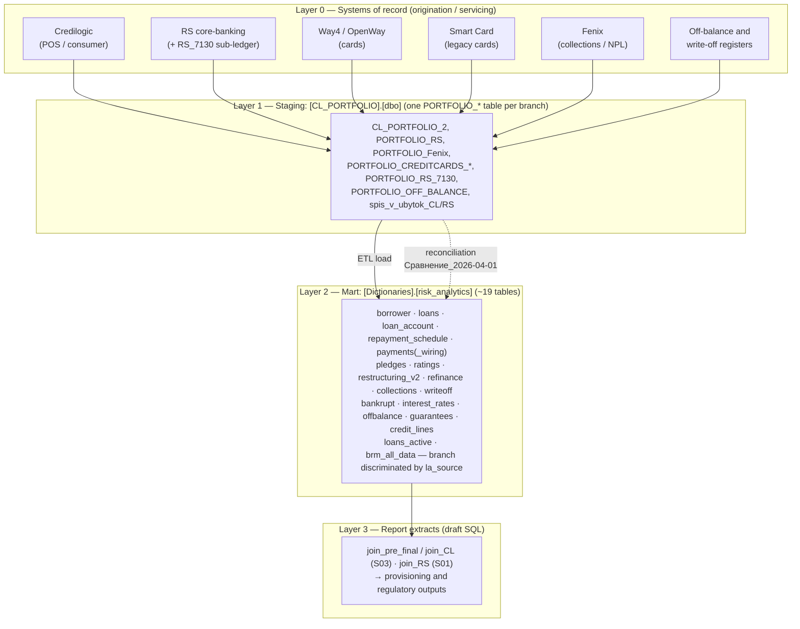
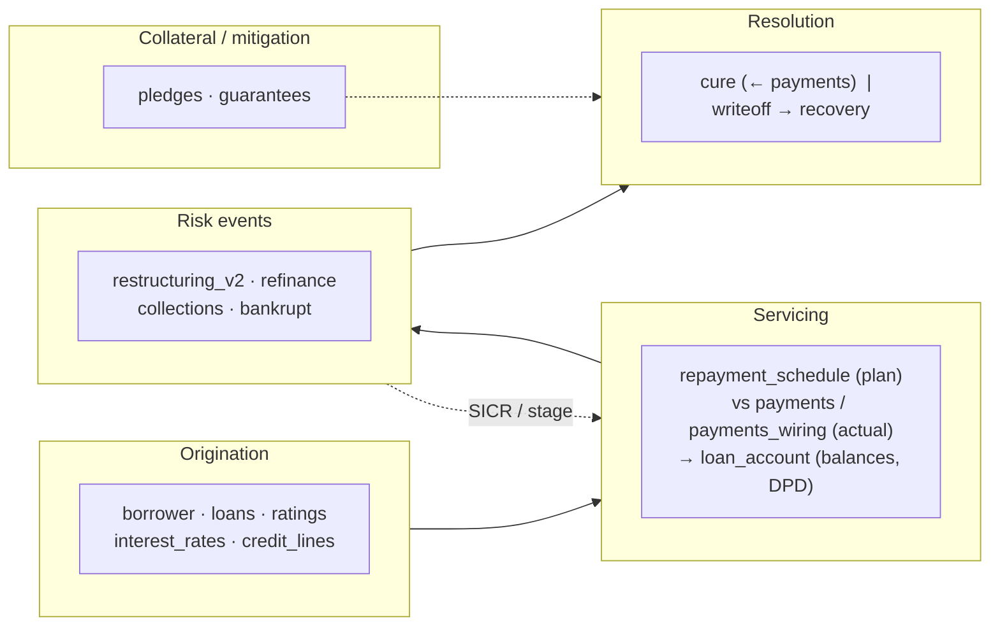

# Knowledge base — credit-risk loan data architecture (AO "Eurasian Bank")

Holistic reference for the loan/provisioning data pipeline: the **source
portfolio branches**, the **`CL_PORTFOLIO` staging layer**, the full
**`Dictionaries.risk_analytics` mart** (its ~19 tables, criticality tiers and
IFRS 9 roles), the **account-computation conventions** distilled from the team's
draft SQL, and a **correctness review** — grounded in the National Bank of
Kazakhstan (NBK) Standard Chart of Accounts.

> **Status of inputs.** The SQL files (`join_CL.sql`, `join_pre_final.sql`,
> `join_RS.sql`) are **working drafts**, not production DDL. They are treated
> here as an *idea warehouse* — they encode how colleagues join the tables,
> which columns they use, and how they compute the GL accounts. They touch only
> 5 of the mart's tables; the **full table inventory** (§4) and the **IFRS 9
> mapping** (§5) come from the team's confirmed table list. Column-level detail
> for the 5 draft tables is in
> [`risk_analytics_data_model.md`](risk_analytics_data_model.md); columns for the
> remaining tables are open items (§10).

## Краткое содержание (RU)

- **Два слоя данных.** Источник — база `CL_PORTFOLIO` (по одной таблице
  `PORTFOLIO_*` на каждую систему-источник / «ветку»). Витрина — схема
  `Dictionaries.risk_analytics`, где «ветку» различает поле `la_source`.
- **Витрина = ~19 таблиц**, а не 5. Полный реестр с уровнями критичности
  (P0/P1/P2) и ролью в МСФО 9 — в §4; карта жизненного цикла и параметров
  PD/LGD/EAD/EIR/SICR — в §5.
- **P0 (фундамент):** `borrower`, `loans`, `loan_account` (и `brm_all_data`,
  если это финальная витрина). **P1 (драйверы резервов/МСФО 9):**
  `repayment_schedule`, `payments`/`payments_wiring`, `pledges`,
  `restructuring_v2`, `ratings`, `writeoff`, `collections`, `bankrupt`,
  `interest_rates`. **P2 (полнота EAD/CCF):** `offbalance`, `guarantees`,
  `credit_lines`, `refinance`.
- **Счета** — из Типового плана счетов НБРК (V1100006793): 1400 — требования к
  клиентам (ОД), 1424 — просроченный ОД, 1740/1741 — вознаграждение, 1428 —
  провизии, 7-й класс (7130) — меморандум (списание в убыток).
- **Что проверить (главное):** база расчёта `provisions_calculated` не совпадает
  с базой `EAD` по знакам счетов 1773/1435 и по набору дисконтов
  (1774/1775/1784) — см. §8. Плюс: неопределённый алиас `b`, дубликат в CASE,
  разное применение `-1` к дням просрочки, риск размножения строк по
  залогам/ставкам, риск двойного счёта при объединении веток.

## 1. Scope and regulatory basis

This pipeline produces the per-contract loan book, its IFRS provisions and the
regulatory extracts for the credit-risk workstream. The GL account columns
(`la_account_XXXX`) are the bank's ledger accounts as defined by:

- **[V1100006793](https://adilet.zan.kz/rus/docs/V1100006793)** — *Standard
  Chart of Accounts for second-tier banks, mortgage organisations, JSC
  "Development Bank of Kazakhstan" and branches of non-resident banks* (NBK Board
  Resolution №3 of 31.01.2011, MoJ reg. №6793). Defines the account classes and
  numbers used throughout §6.
- **[NBK accounting-rules amendments](https://nationalbank.kz/file/download/62676)**
  — resolutions amending bank bookkeeping / financial-reporting rules (assets,
  liabilities, equity, income, expenses; consolidated reporting).

Provisioning follows **IFRS 9** (expected credit loss, staging, SICR) — the model
that the table inventory in §4–§5 is built to feed. Only schema, query logic and
**aggregate** figures appear here; PII fields (`b_borrower_name`, `b_iin_bin`,
`b_rnn`) are marked and not reproduced.

## 2. Architecture — the four layers



- **Layer 0 — systems of record.** The operational platforms that originate and
  service loans (each a "branch" of the book).
- **Layer 1 — `CL_PORTFOLIO` staging.** One `PORTFOLIO_*` table per branch,
  harmonising each source into a portfolio row set. The database is named for its
  first tenant (Credilogic) but now hosts **all** branches. This is the
  **`Cl_portfolio`** side of the reconciliation workbook.
- **Layer 2 — `Dictionaries.risk_analytics` mart.** The consolidated model — the
  full ~19-table inventory in §4. `la_source` records which branch each snapshot
  row came from. This is the **`Dictionaries`** side of the reconciliation.
- **Layer 3 — report extracts.** The draft `join_*.sql` scripts read the mart and
  compute exposures/provisions per contract (touching only 5 of its tables).

## 3. The branches (source portfolios)

Each `[CL_PORTFOLIO].[dbo]` table is one source stream. `la_source` in the mart's
`loan_account` is the corresponding discriminator; only two codes are proven by
the drafts (`S01`=RS, `S03`=Credilogic) — the rest are **inferred** and must be
confirmed against the actual `la_source` reference table.

| Staging table | Branch label | Source system | Nature | `la_source` |
|---|---|---|---|---|
| `CL_PORTFOLIO_2` | Credilogic | Credilogic | POS / consumer lending | **`S03`** (confirmed) |
| `PORTFOLIO_RS` | RS | RS core-banking | Main loan book | **`S01`** (confirmed) |
| `PORTFOLIO_Fenix` | Fenix | Fenix | Collections / recovery (NPL) | ? |
| `PORTFOLIO_CREDITCARDS_WAY4` | CREDITCARDS_WAY4 | Way4 (OpenWay) | Credit cards (current processor) | ? |
| `PORTFOLIO_CREDITCARDS_MIGR_WAY4` | CREDITCARDS_MIGR_WAY4 | Way4 | Cards migrated into Way4 | ? |
| `PORTFOLIO_CREDITCARDS_SMART_CARD` | SMART_CARD | Smart Card | Credit cards (legacy processor) | ? |
| `PORTFOLIO_RS_7130` | RS_7130 | RS (account 7130) | Memorandum / off-balance sub-book | ? |
| `PORTFOLIO_OFF_BALANCE` | OFF_BALANCE | — | Off-balance exposures (Class VI contingents) | ? |
| `spis_v_ubytok_CL` | spis_v_ubytok_CL | Credilogic | Debts written off to loss (списание в убыток) | ? |
| `spis_v_ubytok_RS` | spis_v_ubytok_RS | RS | Debts written off to loss | ? |

**Branch groupings that matter for risk:**

- **On-balance performing/NPL book:** Credilogic, RS, Fenix, the three card
  branches — the exposures that carry `1400`-series principal and `1428`
  provisions.
- **Card branches ×3.** Way4, Smart Card and *migrated* Way4 coexist because a
  card migration is in flight. A single card can plausibly appear in
  `MIGR_WAY4` **and** `WAY4` around cut-over — a concrete de-dup hazard (§8).
- **Off-balance & write-off branches.** `OFF_BALANCE` holds Class VI contingents
  (guarantees, undrawn limits — the mart's `offbalance`/`guarantees`/`credit_lines`
  tables). `RS_7130` and `spis_v_ubytok_*` hold Class VII memorandum balances for
  debts **written off to loss** (the mart's `writeoff` table; loan status `I` =
  *Списанный за баланс*). These must **not** be summed into live exposure: they
  are memorandum, not balance-sheet, amounts.

## 4. The mart tables — full inventory

The mart is ~19 tables, not the 5 the drafts touch. Criticality tiers reflect how
much a wrong/missing table distorts the provisioning number:

- **P0 — foundation.** Portfolio cannot be built without them.
- **P1 — ECL drivers.** Directly set IFRS 9 staging and PD/LGD/EAD/EIR.
- **P2 — exposure completeness.** Off-balance / contingent EAD and condition
  changes.
- **View — derived.** Convenience filters and the consumption mart.

Table types: **Dim** = master/reference entity; **Snap** = periodic snapshot
keyed by a reporting date; **Event** = timestamped transactional log;
**View** = derived.

| Table | Tier | Type | Answers (semantic) | Likely grain / key | Primary risk role |
|---|---|---|---|---|---|
| `borrower` | **P0** | Dim | кто клиент — who the client is | 1 / borrower · `b_borrower_id` | Counterparty, borrower-level PD, connected parties |
| `loans` | **P0** | Dim | какой кредит — the contract & its terms | 1 / contract · `l_loan_number` | Product, term, currency, purpose, rate |
| `loan_account` | **P0** | Snap | сколько должен по счетам — GL balances & DPD | contract × `la_reporting_date` × `la_source` | Exposure, overdue, provisions base |
| `repayment_schedule` | **P1** | Snap/plan | сколько должен платить по графику — contractual cash flows | contract × installment (date/no.) | DPD, cash-flow, EIR, IFRS 9 SPPI/discounting |
| `payments` | **P1** | Event | сколько реально заплатил — actual repayments | 1 / payment (contract, date, amount) | Cure, DPD, behavioural PD |
| `payments_wiring` | **P1** | Event | как платёж разложился — allocation to principal/interest/commission | 1 / payment component | Reconciles payments to `loan_account` buckets |
| `pledges` | **P1** | Dim | какой залог — collateral | collateral item / contract | LGD, recovery, coverage |
| `ratings` | **P1** | Dim (versioned) | какой рейтинг/риск — internal rating | borrower/contract × date | PD, internal rating grade |
| `restructuring_v2` | **P1** | Event | меняли ли условия — modification / forbearance | 1 / restructuring event | SICR → Stage 2/3, forbearance flag |
| `writeoff` | **P1** | Event | списали ли долг — write-off | 1 / write-off per contract | NPL bridge, recovery; ties to `spis_v_ubytok`/7130 |
| `collections` | **P1** | Event/status | передали ли во взыскание — in collections | contract/borrower × case | Problem assets → Stage 3 |
| `bankrupt` | **P1** | Event/flag | есть ли банкротство — bankruptcy | 1 / borrower (or contract) | Hard default indicator → Stage 3 |
| `interest_rates` | **P1** | Dim | какие ставки — contract rates | contract · `dlcr_dog_num` | EIR, discounting, interest EAD |
| `offbalance` | **P2** | Snap | внебалансовые обязательства — contingents | contract × date | EAD/CCF, Class VI |
| `guarantees` | **P2** | Dim/Event | есть ли гарантии — guarantees | guarantee / contract/borrower | Credit-risk mitigation (CRM), LGD |
| `credit_lines` | **P2** | Dim/Snap | лимиты и неиспользованная часть — limits & undrawn | line / contract | Undrawn × CCF → EAD |
| `refinance` | **P2** | Event | новый кредит вместо старого — refinancing link | old → new contract link | Condition change, roll-over / evergreening risk |
| `loans_active` | **View** | View | только действующие — active loans only | filtered `loans` | Convenience filter for live book |
| `brm_all_data` | **P0/P1** | View | общая витрина БРМ — the BRM consumption mart | wide, contract × date | Final витрина — **P0 if reports read it directly** |

**Join model.** The **contract number is the hub** (`loans.l_loan_number`), and
contract-level tables attach to it; borrower-level tables (`borrower`, likely
`bankrupt`, `ratings`, some `guarantees`) attach via `b_borrower_id`. As already
seen in the mart, the key **column names are heterogeneous** across tables
(`la_dog_num`, `c_contract_number`, `dlcr_dog_num` all = `l_loan_number`), so
expect more `*_dog_num` / `*_contract_number` variants. Special cases:
`payments_wiring` → `payments` (payment id); `refinance` links two contracts
(old/new); `repayment_schedule` is contract × installment.

**Detailed columns.** Only `loans`, `borrower`, `loan_account`, `pledges`,
`interest_rates` are catalogued at column level (they appear in the drafts) — see
[`risk_analytics_data_model.md`](risk_analytics_data_model.md). The other tables'
columns/keys/grains are **open items** (§10).

## 5. Credit-risk lifecycle & IFRS 9 mapping

The tables line up along the loan lifecycle; each stage supplies specific IFRS 9
inputs.



| IFRS 9 input | Driven by | Notes |
|---|---|---|
| **DPD** | `loan_account` (`days_past_due`), `repayment_schedule` vs `payments` | 30+ → Stage 2 presumption; 90+ → default/Stage 3 |
| **SICR / forbearance** | `restructuring_v2`, `refinance` | Modification & forbearance → Stage 2/3 |
| **Default (Stage 3)** | `bankrupt`, `collections`, `writeoff`, 90+ DPD | Hard + soft default markers |
| **Cure** | `payments`, `payments_wiring` | Return from Stage 2/3 toward Stage 1 |
| **PD** | `ratings`, `bankrupt` | Rating grade + default flags |
| **LGD** | `pledges`, `guarantees`, `writeoff` | Collateral/CRM coverage + recovery experience |
| **EAD** | `loan_account`, `credit_lines` (undrawn × CCF), `offbalance` (CCF) | On- + off-balance exposure |
| **EIR / discounting** | `interest_rates`, `repayment_schedule` | Effective rate over contractual cash flows |
| **Booked ECL** | `loan_account` (`1428` + `1845` + `18771`) | Posted provision (see §7) |

This mapping also explains the **write-off / memorandum branches** (§3): the
`writeoff`/`collections`/`bankrupt` tables are the mart-side record of the
accounting tail that lands in `spis_v_ubytok_*` and account `7130`. And it gives
the tools to **validate the reconciliation's overdue-principal break** (§9): the
`1424` classification can be checked against `repayment_schedule` vs `payments`
DPD.

## 6. GL accounts — regulatory map

The `la_account_XXXX` columns are the bank's ledger accounts per V1100006793.
The chart is organised in classes: **Class 1** assets, **Class 2** liabilities,
**Class 6** contingent claims/obligations, **Class 7** memorandum (off-balance).

**Confirmed against the Standard Chart of Accounts:**

| Account | Official grouping | Role in the extracts |
|---|---|---|
| `1400` group — `1401`,`1403`,`1411`,`1417` | Требования к клиентам (client loans: overdraft, cards, short/long-term, leasing, factoring…) | Current **principal** — summed as `outstanding` |
| `1424` | Просроченная задолженность клиентов (overdue client debt, within 1400) | **Overdue principal** |
| `1428` | Резервы (провизии) по займам и фин. лизингу клиентам | **IFRS provision** (main ECL) |
| `1740` | Начисленные доходы по займам/лизингу клиентам | Accrued **interest** |
| `1741` | (overdue accrued income, within 1740) | **Overdue interest** |
| Class 7 e.g. `7130` | Меморандумные счета — долги, списанные в убыток | Written-off tail (see `RS_7130`, `spis_v_ubytok_*`, `writeoff`) |

**Functional role from the drafts (verify exact caption against the COA):**

| Account(s) | Used in extracts as | Likely COA meaning |
|---|---|---|
| `1430`, `1431` | `dis_1430`, `1431` | Adjustments / discount within 1400-series |
| `1434`, `1435` | `discount_1434/1435`, `KHD_1434` | Discount / correction of carrying value (ХД/КХД) |
| `1773`, `1774`, `1775`, `1784` | `discount_1773…1784` | Deferred income / discount (1700-series) |
| `1818` | `loan_servicing_commissions` / `commissions` | Accrued commission income (1800-series) |
| `1838` | `overdue_commissions_income` | Overdue commission income |
| `1845` | `ifrs_1845` | Provision component (part of `provisions_total`) |
| `1860` | `fees_1860` | Fees |
| `1877` (+ `18770`, `18771`) | `IFRS1877`, `…_DEB`, `…_WTRAF_i_PENII` | IFRS provision account **and its analytic sub-accounts** (18770 debtor, 18771 write-off traffic & penalties) |
| `1879` | `penalties` | Accrued penalties (неустойка/пеня/штраф) |
| `2794` | `discount_2794` | **Class 2 (liability/deferred)** — deferred income / premium; verify |

> `18770`/`18771` are 5-digit **analytic extensions of `1877`** (bank
> sub-ledger), not separate COA accounts.

## 7. How the accounts are computed (team conventions)

These formulas are consistent across the three drafts and are the **canonical
definitions** the team uses. They belong in the mart/BI layer, not scattered in
ad-hoc SQL.

```text
outstanding            = 1401 + 1403 + 1411 + 1417                     -- current principal
od                     = outstanding + 1424                            -- total principal (incl. overdue)
balance                = od + 1740 + 1741 + 1879 + 1818 + 1838         -- gross exposure
OD_percent             = od + 1740 + 1741                              -- principal + interest only
balance_with_discount  = balance                                       -- EAD (net of discounts)
                         - (1434 + 1773 + 1774 + 1784)
                         - (-1435 + 1775)
provisions_calculated  = ( balance - (1434 - (-1435) - 1773) )         -- recomputed ECL
                         * currency_reserve_percentage / 100
provisions_total       = 1428 + 1845 + 18771                           -- booked ECL (from GL)
dpd                    = days_past_due - 1
```

Delinquency buckets (`basket`) on `days_past_due`: no-overdue (`≤1`/null),
`1–29`, `30–59`, `60–89`, `90+`; `90+` also emitted as a 0/1 flag and `90+sum`.
`provisions_total` (booked) vs `provisions_calculated` (recomputed) is the
control pair — their divergence is what provisioning review inspects.

## 8. Correctness review — «всё ли там правильно»

Ranked by impact. **C** = confirmed defect, **V** = needs verification / design
decision.

| # | Sev | Where | Finding | Fix / action |
|---|---|---|---|---|
| 1 | **C** | `provisions_calculated` vs `balance_with_discount` | The discount base for **provisions** and for **EAD** disagree. Provisions base = `balance − 1434 − 1435 + 1773`; EAD base = `balance − 1434 − 1773 − 1774 − 1784 + 1435 − 1775`. **Signs of `1773` and `1435` are opposite** between the two, and provisions ignore `1774/1775/1784`. IFRS ECL should sit on the same carrying base as EAD. This is the likely driver of the Excel gap where `provisions_calculated` (127.5 bn) far exceeds booked `provisions_total` (≈109–117 bn). | Agree ONE discount base. Almost certainly `provisions_calculated` should reuse the EAD net base; the `-(1434-(-1435)-1773)` term is a legacy simplification predating accounts `1774/1775/1784`. |
| 2 | **C** | `join_RS.sql`, `b.b_oked 'Sector'` | Alias `b` is undefined — the borrower table is aliased `br`. As written the query fails to compile. | `br.b_oked`. |
| 3 | **C** | `1435` sign | CL/pre-final negate `1435` (`-la.la_account_1435`); RS uses it raw. Combining CL and RS outputs mixes sign conventions. | Normalise `1435` (and the whole discount block) to one sign at the mart layer. |
| 4 | **C** | DPD `-1` offset | CL applies `-1` to `days_past_due` (dpd) but **not** to `days_past_due_principal/_interest/max`; RS applies `-1` to the principal/interest/max day columns **and** to dpd. Same metric, different offset per report. | Fix the offset once in the mart; stop subtracting in the report layer. |
| 5 | **C** | `join_RS.sql` purpose `CASE` | `120000000000004209` appears in **two** branches (differ only by capitalisation); the second is unreachable dead code. | Delete the duplicate; move the purpose map to a lookup table. |
| 6 | **V** | Join fan-out | `pledges` (CL) and `interest_rates` (RS) are 1-to-many. A loan with several collateral/rate rows **multiplies** the `loan_account` money columns. RS masks this by filtering one contract; at scale it double-counts. The same hazard applies to any 1-to-many table (`payments`, `restructuring_v2`, `guarantees`) joined without aggregation. | Enforce ≤1 row per loan (pick latest / aggregate) before joining. |
| 7 | **V** | Branch / `la_source` mixing | Each extract pins one `la_source`. Across branches a contract can exist twice — e.g. a card in `MIGR_WAY4` **and** `WAY4`, or a loan in `PORTFOLIO_RS` **and** `spis_v_ubytok_RS`. Unioning branches without de-dup double-counts balances **and** provisions. | Define branch precedence + de-dup keys; never sum memorandum (7130 / write-off) with live balance. |
| 8 | **V** | `provisions_total` composition | `provisions_total = 1428 + 1845 + 18771` includes `18771` but **not** `18770` (debtor) or `1877` (parent), though all are selected. | Confirm whether `18770`/`1877` belong in booked ECL, or are deliberately receivables. |
| 9 | **V** | `'status'` semantics | `join_pre_final` labels **`l_loan_status`** (decoded) as `status`; `join_CL` labels **`la.la_status`** (account status) as `status`. Two different fields share one column name. | Pick one; name them `loan_status` vs `account_status` distinctly. |
| 10 | **V** | `la_account_1877` unqualified | Selected without the `la.` prefix (relies on the name being unique across joined tables). | Qualify all columns. |

**What is right:** the principal/interest/penalty/commission assembly
(`outstanding → od → balance`) is internally consistent and repeated identically
across all three drafts; the join graph off `loans` is correct; `provisions_total`
matches the standalone provisions check query. The core model is sound — the
issues are concentrated in the **discount/provision base (#1)** and in
**multi-branch de-duplication (#6, #7)**.

## 9. Reconciliation — `CL_PORTFOLIO` staging ↔ mart (2026-04-01)

The `Сравнение_2026-04-01.xlsx` workbook reconciles the **`CL_PORTFOLIO`
staging** side against the **`Dictionaries` mart** at `2026-04-01` (the same
snapshot the `S03` pre-final extract targets). Aggregate figures (₸, bn = 10⁹):

| Metric | Cl_portfolio | Dictionaries | Difference |
|---|---:|---:|---:|
| Contract count | 263,450 | 261,464 | **+1,986** |
| Outstanding (principal) | 904.87 bn | 902.97 bn | +1.90 bn |
| Overdue principal (1424) | 23.29 bn | 5.74 bn | **+17.55 bn** |
| `od` | 928.16 bn | 908.72 bn | +19.44 bn |
| `balance` | 962.02 bn | 937.33 bn | +24.69 bn |
| Provisions `1428` | 108.62 bn | 113.96 bn | −5.34 bn |
| EAD (`balance_with_discount`) | 933.28 bn | 910.90 bn | +22.39 bn |
| `provisions_calculated` | 127.48 bn | 112.62 bn | +14.85 bn |
| `provisions_total` | 109.06 bn | 117.01 bn | **−7.95 bn** |

**Reading it:**
- **Population gap** drives most rows: ≈3,544 contracts in staging but not the
  mart, ≈1,559 in the mart but not staging → net **+1,986**. The two books differ
  in **both** directions (not a one-way lag) — consistent with §8 de-dup / branch
  scope questions.
- **Overdue principal** is the largest relative break (+17.55 bn): staging
  classifies far more `1424` than the mart — a **staging vs mart mapping/timing**
  difference in what counts as overdue. Cross-check via `repayment_schedule` vs
  `payments` DPD (§5).
- **Provisions move opposite to exposure** — the mart holds *more* booked ECL
  (`1428` −5.34 bn; `provisions_total` −7.95 bn) despite *less* overdue balance,
  while staging's *recomputed* `provisions_calculated` is +14.85 bn. This is
  finding **#1** surfacing at portfolio scale: the recompute base ≠ the booked
  base. Reconcile the provisions line first.

The workbook is an **ETL data-quality control** confirming the staging→mart load
is complete and value-accurate before the numbers feed IFRS provisioning and
regulatory reporting.

## 10. Open questions to confirm

1. **`la_source` dictionary** — the full code↔branch map (only `S01`=RS,
   `S03`=CL are proven). Where do Fenix, the three card branches, `RS_7130`,
   `OFF_BALANCE` and the write-off branches land?
2. **`brm_all_data` scope** — is it the **final BRM consumption витрина**? If so
   it is **P0**, and Layer-3 reports should read it rather than re-joining base
   tables. Confirm what it contains (which of the ~19 tables are pre-joined) and
   its grain.
3. **Keys & grains of the newly-inventoried tables** — confirm join keys and
   whether contract- or borrower-level for `repayment_schedule`, `payments`,
   `payments_wiring`, `ratings`, `restructuring_v2`, `refinance`, `collections`,
   `writeoff`, `bankrupt`, `offbalance`, `guarantees`, `credit_lines`.
4. **`payments` vs `payments_wiring`** — confirm `payments_wiring` is the
   allocation breakdown (principal / interest / commission / penalty) and that it
   reconciles to the `loan_account` GL buckets.
5. **Stage / SICR source of truth** — which table/column carries the IFRS 9 stage
   (1/2/3) and the SICR / forbearance flags (`restructuring_v2`? a stage column on
   `loan_account`?).
6. **Provision base (#1)** — is the `provisions_calculated` discount base a
   deliberate policy or a legacy bug? This decides ≈15 bn of the gap.
7. **Account captions** — pin `1430/1431/1773/1774/1775/1784/1818/1838/1860/2794`
   to their exact V1100006793 captions (§6 lists functional roles).
8. **Write-off / off-balance handling** — confirm memorandum branches (7130,
   `spis_v_ubytok_*`, `OFF_BALANCE`) and the `writeoff`/`offbalance` tables are
   excluded from live-exposure sums.

## 11. Glossary (RU/EN)

| RU | EN / meaning |
|---|---|
| Требования к клиентам | Client loan claims (account class 1400) |
| Провизии / резервы | Provisions / reserves (ECL) — `1428`, `1845`, `18771` |
| Вознаграждение | Interest (`1740` accrued, `1741` overdue) |
| Основной долг (ОД) | Principal (`outstanding`; `od` incl. overdue `1424`) |
| Просрочка / дней просрочки (DPD) | Overdue / days past due |
| Дисконт (ХД/КХД) | Discount / carrying-value correction (`1434/1435/1773…`) |
| Списание в убыток | Write-off to loss (Class 7 memorandum, `7130`; `writeoff` table) |
| Внебалансовый / меморандум | Off-balance / memorandum (Class 6/7; `offbalance`) |
| Реструктуризация / форбиренс | Restructuring / forbearance (`restructuring_v2`) → SICR |
| Рефинансирование | Refinancing (`refinance`) — new contract replaces old |
| Взыскание | Collections (`collections`) — problem-asset recovery |
| Кюр (cure) | Return from Stage 2/3 to Stage 1 after payments |
| Ветка / источник | Branch / source system (`la_source`) |
| МСФО 9 / IFRS 9 | Expected-credit-loss provisioning standard |
| SICR | Significant Increase in Credit Risk → Stage 2 |
| Stage 1/2/3 | Performing / underperforming (SICR) / credit-impaired |
| PD / LGD / EAD | Probability of Default / Loss Given Default / Exposure at Default |
| CCF | Credit Conversion Factor (undrawn/off-balance → EAD) |
| EIR (ЭПС) | Effective Interest Rate — discounting of cash flows |
| NPL | Non-performing loan |

## Sources

- [V1100006793 — Standard Chart of Accounts for second-tier banks (NBK, 31.01.2011)](https://adilet.zan.kz/rus/docs/V1100006793)
- [NBK accounting-rules amendments (nationalbank.kz file 62676)](https://nationalbank.kz/file/download/62676)
- Team table inventory + criticality/semantic map (this session)
- Draft SQL: `join_CL.sql`, `join_pre_final.sql`, `join_RS.sql` (idea warehouse)
- Reconciliation workbook `Сравнение_2026-04-01.xlsx`
- Companion: [`risk_analytics_data_model.md`](risk_analytics_data_model.md)
