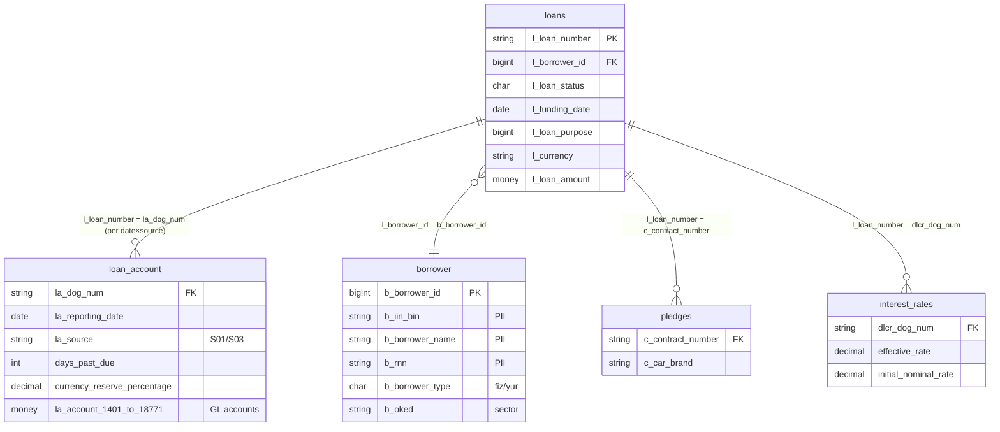

# Data-model analysis — `Dictionaries.risk_analytics` (loan / provisioning mart)

Analysis of the SQL Server data model behind three provisioning/IFRS report
extracts and one portfolio reconciliation workbook received for the credit-risk
workstream (AO "Eurasian Bank"). It documents the **database, schema, tables,
join keys, snapshot grain, the GL-account columns, and the derived risk
metrics**, then reads the CL↔Dictionaries reconciliation and flags data-quality
issues.

Only schema, query logic and **aggregate** portfolio figures are reproduced
here — no borrower-level rows. Fields that carry personal data (name, IIN/BIN,
RNN) are marked **PII** and were not extracted.

> **See also** [`credit_risk_knowledge_base.md`](credit_risk_knowledge_base.md)
> for the end-to-end architecture (the `CL_PORTFOLIO` source-branch staging layer
> that feeds this mart, the `la_source` branch map, the NBK chart-of-accounts
> grounding, and the consolidated correctness review). This document is the
> detailed **mart-schema** reference.

**Source artifacts**

| Artifact | What it is | Source system (`la_source`) | Snapshot (`la_reporting_date`) |
|---|---|---|---|
| `join_pre_final.sql` | Credilogic provisioning extract ("pre-final") | `S03` | `2026-04-01` |
| `join_CL.sql` | Same Credilogic extract, next month | `S03` | `≥ 2026-05-01` |
| `join_RS.sql` | "RS" regulatory extract (richer borrower + rate detail) | `S01` | `≥ 2026-01-01` |
| `Сравнение_2026-04-01.xlsx` | CL-portfolio ↔ Dictionaries reconciliation | — | `2026-04-01` |

---

## 1. Database and schema

All queries use SQL Server three-part naming against a single database and
schema:

```
[Dictionaries].[risk_analytics].[<table>]
```

- **Database:** `Dictionaries` — the risk analytics data mart / warehouse.
- **Schema:** `risk_analytics` — the loan-book fact + dimension tables that feed
  IFRS provisioning and regulatory reporting.

`Dictionaries.risk_analytics` is the **target** mart. Upstream source systems
(Credilogic and the "RS" core-banking system) load into it and are distinguished
by the `la_source` column (§5). The Excel workbook reconciles one such source
(`Cl_portfolio` = Credilogic) against what landed in the mart.

## 2. Tables and relationships

Five tables, all joined off the driving table `loans` with `LEFT JOIN` (so a
loan is never dropped for missing borrower / account / collateral / rate rows).

| Table | Alias | Grain (one row per…) | Role |
|---|---|---|---|
| `loans` | `l` | loan / contract | **Driving** dimension — contract master |
| `borrower` | `br` (`b`¹) | borrower | Borrower master (PII) |
| `loan_account` | `la` | **loan × reporting date × source** | **Fact / snapshot** — balances & risk metrics |
| `pledges` | `p` | collateral item | Collateral (used by CL extracts) |
| `interest_rates` | `i` | loan rate record | Rates (used by RS extract) |

¹ `join_RS.sql` refers to `b.b_oked` though the borrower table is aliased `br` —
an undefined alias (see §9, bug #1).

### Join keys

The contract number is the hub. It appears under a **different column name in
each table**, reflecting the different upstream systems that populate them:

```
loans.l_borrower_id   = borrower.b_borrower_id       -- many loans : 1 borrower
loans.l_loan_number   = loan_account.la_dog_num      -- 1 loan : many dated snapshots
loans.l_loan_number   = pledges.c_contract_number    -- 1 loan : 0..N collateral rows
loans.l_loan_number   = interest_rates.dlcr_dog_num  -- 1 loan : rate record(s)
```

`*_dog_num` / `*_contract_number` all mean *номер договора* (contract number).
The prefix differences (`la_`, `c_`, `dlcr_`) are a naming-heterogeneity signal —
each satellite table was modelled by/for a different source feed.



> ⚠️ **Fan-out caution.** `pledges` and `interest_rates` are 1-to-many. A loan
> with several collateral items or rate records will **multiply** across the
> join, double-counting the `loan_account` money columns. The extracts assume
> ≤1 matching row per loan; that assumption should be enforced (dedup / pick
> latest) before summing balances.

## 3. `loans` (`l`) — contract dimension

| Column | Report alias(es) | Meaning |
|---|---|---|
| `l_loan_number` | `contract_number` | Contract no. (natural key); e.g. `L…`, `F…/…` |
| `l_loan_id` | `contract id` | Internal contract id |
| `l_loan_status` | `status` | Status code — decoded below |
| `l_funding_date` | `granting_date` / `open_date` | Disbursement date |
| `l_first_repayment_date` | `first_pmt_date` / `financing_date` | First scheduled payment |
| `l_scheduled_closure_date` | `close_date` | Scheduled maturity |
| `l_loan_purpose` | `loan_purpose` / `target_prod` | Purpose code (big-int → RU label, §8) |
| `l_product_type` | `product` | Product type |
| `l_subproduct_type` | `subproduct` | Sub-product |
| `l_loan_type` | `credittype` | Loan type |
| `l_segment` | `Segment` | Client/portfolio segment |
| `l_branch_name` / `l_branch_code` | `filial` | Branch |
| `l_initial_term_months` | `LoanDuration` | Original term (months) |
| `l_financial_consultant` | `FKLogin` / `FK` | Financial-consultant login |
| `l_tag` | `tag` | Free tag |
| `l_currency` | `valuta` / `curr` | Currency |
| `l_rate` | `tarif` / `producttype`² | Contract rate / tariff |
| `l_loan_amount` | `Creditamount` | Original principal |
| `l_borrower_id` | — | FK → `borrower` |

² RS aliases `l_rate` as `producttype` — a label mismatch, harmless but confusing.

**`l_loan_status` decode** (from the CASE in the CL extracts):

| Code | Status (RU) | EN |
|---|---|---|
| `T` | Ожидает подтверждения моделирования | Awaiting model confirmation |
| `C` | Закрытый | Closed |
| `A` | Отмененный | Cancelled |
| `I` | Списанный за баланс | Written off (off balance) |
| `V` | Расторгнутый | Terminated |
| `Z` | Погашен досрочно | Repaid early |
| `O` | Открытый | Open |
| `Y` | Закрытый | Closed |

(`C` and `Y` both map to "Closed".) `join_CL.sql` skips this CASE and takes
`la.la_status` from the fact table instead.

## 4. `borrower` (`br`) — borrower dimension (PII)

| Column | Alias | Meaning |
|---|---|---|
| `b_borrower_id` | — | PK; FK target from `loans` |
| `b_borrower_name` | `Client` | **PII** — name |
| `b_iin_bin` | `IIN` / `iin` | **PII** — individual (ИИН) / business (БИН) tax id |
| `b_rnn` | `rnn` | **PII** — taxpayer registration number |
| `b_borrower_type` | `fiziki/yuriki` | Natural person vs legal entity |
| `b_oked` | `Sector` | OKED economic-activity (sector) code |

## 5. `loan_account` (`la`) — the fact/snapshot table

The heart of the model: a **monthly snapshot** of GL balances and risk
attributes per loan. Its grain is:

```
(la_dog_num, la_reporting_date, la_source)
```

Every extract therefore filters on both a reporting date and a source, e.g.:

```sql
WHERE la.la_reporting_date >= '2026-05-01'
  AND la.la_source = 'S03'
```

**Key / dimension columns**

| Column | Alias | Meaning |
|---|---|---|
| `la_dog_num` | — | Contract no. (join key) |
| `la_reporting_date` | `date` / `actual_date` | Snapshot date (month boundary) |
| `la_source` | — | **Source-system code** — see below |
| `la_status` | `status` | Status at snapshot |
| `delinquency_bucket` | `category` / `Basket` | Delinquency category |
| `days_past_due` | `dpd` (`−1`) | Days past due |
| `days_past_due_principal` | `overdue_days_principal` | DPD on principal |
| `days_past_due_interest` | `overdue_days_interest` | DPD on interest |
| `max_days_past_due_principal_interest` | `maxDPD` / `max_overdue_days` | Max of the two |
| `currency_reserve_percentage` | `percent` / `ifrs_percent` | IFRS reserve rate (%) |
| `currency_exchange_rate` | `kurs_valut` | FX rate to base currency |

> `dpd` is reported as `days_past_due − 1` (and the RS DPD-day columns as
> `… − 1`). The snapshot appears to count the reporting day itself, and the
> report subtracts it. Keep this off-by-one convention in mind when comparing
> DPD to bucket boundaries.

### `la_source` — the source-system dimension

| Code | Portfolio / system | Seen in |
|---|---|---|
| `S01` | Core-banking / "RS" book | `join_RS.sql` |
| `S03` | **Credilogic** (extracts hard-code `tag_1 = 'CREDILOGIC'`) | `join_CL.sql`, `join_pre_final.sql` |

A single contract number can exist under more than one source. **Never union
`S01` and `S03` without dedup** — the money columns would double-count
(see §9, #5). The Excel reconciliation is essentially a check that the `S03`
slice of the mart matches the Credilogic source of record.

### `la_account_*` — GL chart-of-accounts columns

These are the bank's ledger accounts carried as one money column each. Grouped
by economic meaning as used in the report formulas:

| Account(s) | Role in the report |
|---|---|
| `1401`, `1403`, `1411`, `1417` | Current **principal** outstanding (summed = `outstanding`) |
| `1424` | **Overdue principal** |
| `1740` | Accrued **interest** |
| `1741` | **Overdue interest** |
| `1818` | Loan-servicing **commissions** |
| `1838` | Overdue commission income |
| `1879` | **Penalties** (пеня/штраф) |
| `1428` | **IFRS provision** (main ECL account) |
| `1845` | IFRS provision component |
| `1877`, `18770`, `18771` | IFRS: deferred / debtor / write-off-traffic & penalty provisions |
| `1430`, `1431`, `1434`, `1435` | Discounts / adjustments (ХД / КХД) |
| `1773`, `1774`, `1775`, `1784`, `2794` | Further discount accounts |
| `1860` | Fees |

## 6. `pledges` (`p`) — collateral

| Column | Alias | Meaning |
|---|---|---|
| `c_contract_number` | — | Contract no. (join key) |
| `c_car_brand` | `CARBRAND` | Collateral car make (auto-loan collateral) |

Used only by the CL extracts. `p.c_car_brand IS NOT NULL` filters exist
(commented out) to isolate the auto/collateralised book.

## 7. `interest_rates` (`i`) — rates

| Column | Alias | Meaning |
|---|---|---|
| `dlcr_dog_num` | — | Contract no. (join key) |
| `effective_rate` | `Eff_prs` | Effective rate (ГЭСВ / APR) |
| `initial_nominal_rate` | `persent` | Initial nominal rate |

Used only by the RS extract.

## 8. Derived business metrics (report layer)

The extracts compute the standard credit-risk aggregates on top of the GL
columns. These formulas are **consistent across the three files** and are the
canonical definitions for the workstream:

```text
outstanding            = 1401 + 1403 + 1411 + 1417                     -- current principal
od                     = outstanding + 1424                            -- total principal (incl. overdue)
balance                = od + 1740 + 1741 + 1879 + 1818 + 1838         -- gross exposure
OD_percent             = od + 1740 + 1741                              -- principal + interest
balance_with_discount  = balance                                       -- EAD (net of discounts)
                         - (1434 + 1773 + 1774 + 1784)
                         - (-1435 + 1775)
provisions_calculated  = ( balance - (1434 - (-1435) - 1773) )         -- recomputed ECL
                         * currency_reserve_percentage / 100
provisions_total       = 1428 + 1845 + 18771                           -- booked ECL (GL)
dpd                    = days_past_due - 1
```

**Delinquency buckets** (`basket`), on `days_past_due`:

| Bucket | Condition |
|---|---|
| без просрочек (no overdue) | `dpd ≤ 1` or `NULL` |
| от 1 до 29 | `1 < dpd ≤ 30` |
| от 30 до 59 | `30 < dpd ≤ 60` |
| от 60 до 89 | `60 < dpd ≤ 90` |
| 90+ | `dpd > 90` |

`90+` is also emitted as a 0/1 flag and `90+sum` (the `balance` when `dpd > 90`)
for NPL reporting.

**`provisions_total` (booked) vs `provisions_calculated` (recomputed)** is a
deliberate control pair: the first reads the ECL actually posted to the ledger
(`1428 + 1845 + 18771`), the second re-derives it from exposure ×
reserve-percentage. Divergence between them is exactly what provisioning review
looks for, and the Excel surfaces it at portfolio level (§10).

`join_RS.sql` also builds an `ifrs_balance` variant that adds `1430` and drops
the commission-vs-penalty ordering — a regulator-report-specific exposure base.

**`l_loan_purpose` decode (RS extract).** Purpose is a big-int code decoded to a
RU label via a 55-branch CASE. The codes are structured:
`1_0000000000_0NNN_209` and `1_2000000000_0NNN_209` — a base range and a
`120…` range that repeat the same `NNN` purpose list (e.g. `…001209` =
"Потребительские цели"/consumer, `…003209` = auto purchase, `…004209` =
mortgage-purchase, `…010209` = production, `…014209` = leasing). The two ranges
likely separate two product families or booking entities sharing one purpose
dictionary.

## 9. The three extracts compared

All three share the `loans → borrower → loan_account` spine; they differ in the
satellite join, the source filter, and the output columns.

| Aspect | `join_pre_final.sql` | `join_CL.sql` | `join_RS.sql` |
|---|---|---|---|
| Source (`la_source`) | `S03` | `S03` | `S01` |
| Reporting date | `= 2026-04-01` | `≥ 2026-05-01` | `≥ 2026-01-01` |
| Extra join | `pledges` | `pledges` | `interest_rates` |
| Status column | CASE on `l_loan_status` | `la.la_status` | — |
| `FKLogin` | `NULL` | `l_financial_consultant` | `l_financial_consultant` |
| Borrower PII | IIN only | IIN only | name + IIN + RNN |
| Rates | — | — | effective + nominal |
| Purpose | raw code | raw code | decoded (CASE) |
| Trailing check | **active** `SUM(provisions_total)` | commented out | commented out |
| Output shaping | flat | flat | per-date `.xlsx` name + `ROW_NUMBER()` id |

`join_pre_final` and `join_CL` are the **same Credilogic report one month
apart** — April (pre-final close) and May. `join_RS` is a separate,
borrower-rich regulatory extract over the `S01` book (currently pinned to a
single contract for drill-down testing, `l_loan_number = '…'`).

## 10. The reconciliation workbook (`Сравнение_2026-04-01`)

One sheet compares the **`Cl_portfolio`** staging side (the `CL_PORTFOLIO`
source-branch database — see the knowledge base) against **`Dictionaries`** (the
mart) at `2026-04-01`. Columns: `Cl_portfolio | Dictionaries | Разница (diff) |
Σ contracts in CL missing from Dictionaries | Σ contracts in Dictionaries missing
from CL`.

| Metric | Cl_portfolio | Dictionaries | Difference |
|---|---:|---:|---:|
| Contract count | 263,450 | 261,464 | **+1,986** |
| Outstanding (principal) | 904.87 bn | 902.97 bn | +1.90 bn |
| Overdue principal (1424) | 23.29 bn | 5.74 bn | **+17.55 bn** |
| `od` (total principal) | 928.16 bn | 908.72 bn | +19.44 bn |
| `balance` (gross exposure) | 962.02 bn | 937.33 bn | +24.69 bn |
| Provisions `1428` (ifrs) | 108.62 bn | 113.96 bn | **−5.34 bn** |
| `OD_percent` | 961.22 bn | 936.55 bn | +24.67 bn |
| EAD (`balance_with_discount`) | 933.28 bn | 910.90 bn | +22.39 bn |
| `provisions_calculated` | 127.48 bn | 112.62 bn | +14.85 bn |
| `provisions_total` | 109.06 bn | 117.01 bn | **−7.95 bn** |

*(Amounts in tenge, bn = 10⁹; figures are aggregate portfolio totals.)*

**Reading the reconciliation**

- **Population gap drives most of it.** ≈3,544 contracts sit in CL but not in
  the mart, and ≈1,559–1,985 sit in the mart but not in CL; net **+1,986**
  contracts on the CL side. On outstanding, the CL-only contracts add +282.7 M
  and the mart-only contracts add +705.2 M the other way, for a **net −422.6 M**
  population effect — i.e. the two books differ in **both** directions, not a
  simple one-way lag.
- **Overdue principal is the largest relative break** (+17.55 bn; CL 23.29 bn vs
  mart 5.74 bn). This points at a **status/staging timing difference** — CL is
  classifying far more principal as overdue than the `S03` snapshot did.
- **Provisions move the opposite way** to exposure: the mart holds *more* booked
  ECL (`1428`: −5.34 bn; `provisions_total`: −7.95 bn) despite *less* overdue
  balance, while CL's *recomputed* `provisions_calculated` is 14.85 bn higher.
  Booked-vs-recomputed and CL-vs-mart disagree at once — the provisioning line
  is where source and mart are least aligned and should be reconciled first.

**Purpose of the workbook:** an ETL / data-quality control confirming that the
Credilogic load into `Dictionaries.risk_analytics` (`la_source = 'S03'`,
`2026-04-01`) is complete and value-accurate before the numbers feed IFRS
provisioning and regulatory reporting. The material breaks above (overdue
principal, provisions) are the reconciliation's action items.

## 11. Data-quality observations

1. **Undefined alias in `join_RS.sql`.** `b.b_oked 'Sector'` references alias
   `b`, but the borrower table is aliased `br`. As written this errors
   (invalid column prefix); it should be `br.b_oked`.
2. **Duplicate CASE branch.** In the RS purpose decode, `100000000000004209`
   and the pair `120000000000004209` appear with two branches each (differing
   only in capitalisation, "На покупку" vs "на покупку"). T-SQL takes the first
   match, so the duplicate is dead code — harmless but should be removed.
3. **Inconsistent `1435` sign.** CL/pre-final negate it (`-la.la_account_1435`,
   and `-(-1435)` inside `provisions_calculated`); RS uses it raw. Any consumer
   combining outputs must normalise the sign of `1435` (and the discount block
   generally) first.
4. **1-to-many fan-out** on `pledges` / `interest_rates` (§2) can multiply the
   `loan_account` money columns. Enforce one row per loan before aggregating.
5. **Source mixing.** Each extract pins a single `la_source`; a contract may
   exist under several sources. Unioning `S01`+`S03` without dedup double-counts
   balances and provisions.
6. **Off-by-one DPD.** `days_past_due − 1` (and the `… − 1` day columns) is a
   report convention, not the raw snapshot value — align bucket edges to it.

## 12. Relation to this repository

This mart is the **quantitative** side of the same credit-risk workstream the
topic classifier serves on the **document** side. The reconciliation workbook is
a concrete instance of the topics the taxonomy already tracks — `provisions_ecl`
(IFRS `1428`/`1845`/`18771`), `credit_risk`, `aqr` (asset-quality / provisioning
adequacy), and `mgmt-reporting` (period-close controls). Nothing in the mart is
imported by the classifier; this document is **reference material** so that when
provisioning-review or reconciliation memos arrive as documents, the account
codes, metric definitions and `S01/S03` source split here explain what the
numbers in them mean.
